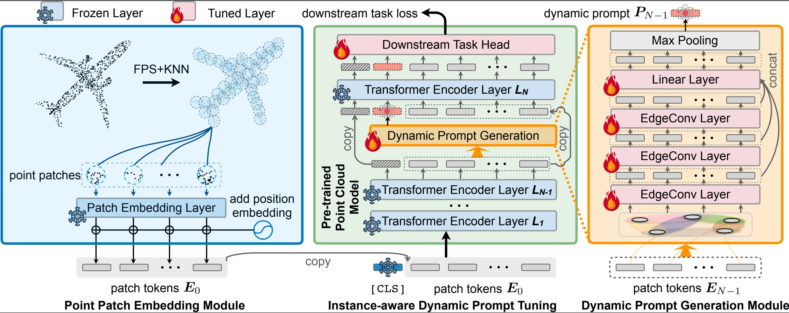

# IDPT: Instance-aware Dynamic Prompt Tuning for Pre-trained Point Cloud Models

## Introduction

In this paper, we examine the introduction of prompt tuning into pre-trained point cloud models as a strategy for reducing the number of parameters needed for downstream tasks. Initially, we adopt visual prompt tuning to point cloud pre-trained models and found that the static prompt tuning cannot work well in real point clouds due to the data distribution diversity. To address this issue, we propose an instance-aware dynamic prompt tuning (IDPT) to produce a universal prompt for both synthetic and real point clouds, which is adaptive to instance input. Extensive experimentation validates our IDPT strategy as a universal and effective solution.

## Code

Comming soon.

## Acknowledgements

This repo benefits from [Point-MAE](https://github.com/Pang-Yatian/Point-MAE), [ACT](https://github.com/RunpeiDong/ACT), [VPT](https://github.com/KMnP/vpt), and [DGCNN](https://github.com/WangYueFt/dgcnn). Thanks for their wonderful works.

## Contact

If you have any question about this project, please feel free to contact chayh21@mails.tsinghua.edu.cn.
